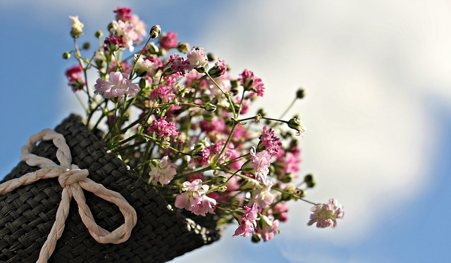

# 🌿 Wydarzenia i targi roślinne

Rośliny doniczkowe to nie tylko domowa ozdoba – to również pasja i społeczność!  
W całej Polsce (i Europie) odbywają się wydarzenia, które gromadzą miłośników zieleni.

To doskonała okazja, aby poznać nowe gatunki, porozmawiać z hodowcami, kupić ciekawe okazy oraz wziąć udział w warsztatach i wymianach.

  

---

## 🌱 Festiwal Roślin – Polska

🔸 Cykl ogólnopolskich wydarzeń w miastach takich jak Warszawa, Kraków, Wrocław, Gdańsk czy Poznań  
🔸 Wstęp darmowy, szeroka oferta roślin kolekcjonerskich, akcesoriów, nawozów i doniczek  
🔸 Idealna okazja do uzupełnienia swojej domowej dżungli lub zadania pytań specjalistom

🔗 Strona: [festiwalroslin.pl](https://festiwalroslin.pl)

---

## 🪴 Green Days – Targi Ogrodnictwa

📍 Miejsce: PTAK Warsaw Expo, Nadarzyn k. Warszawy  
📅 Termin: zwykle marzec  
🌿 Największe targi ogrodnicze w Polsce – ogromna hala, setki stoisk, pokazy florystyczne, wykłady i warsztaty  
🧠 Część wydarzenia dedykowana roślinom doniczkowym i wnętrzom pełnym zieleni

---

## 🪻 Zielony Bazar – lokalne spotkania i wymiany

🌼 Kameralne wydarzenia organizowane w klubokawiarniach, parkach lub galeriach  
🔁 Możliwość wymiany sadzonek, doniczek, rozmów i poznania nowych pasjonatów  
🧃 Często połączone z muzyką, warsztatami, kawą i roślinną atmosferą

---

## 🌍 Europejskie festiwale roślin

🇩🇪 Houseplant Festival – Berlin  
📆 Maj lub wrzesień  
🪴 Pokazy roślin domowych, designu wnętrz i rękodzieła

🇨🇿 Botanika Brno – Czechy  
🌱 Targi kolekcjonerskich roślin doniczkowych i podłoży

🇳🇱 Floriade Expo – Holandia (co 10 lat)  
🌼 Największe światowe wydarzenie związane z architekturą zieleni i roślinami

---

## 📢 Jak być na bieżąco?

🔎 Obserwuj media społecznościowe:  
– Festiwal Roślin (FB, IG)  
– Zielone Pogotowie  
– Grupy typu „Rośliny doniczkowe – wymiana, sprzedaż, porady”

📬 Śledź wydarzenia lokalne przez:  
– Domy kultury  
– Centra ogrodnicze  
– Ogłoszenia na Facebooku i w wydarzeniach Google

---

> 💚 Zanurz się w zielonym świecie – odwiedzaj festiwale, poznawaj ludzi i inspiruj się roślinnym stylem życia!

