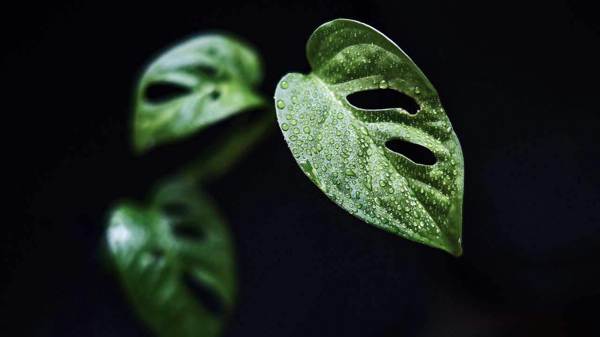
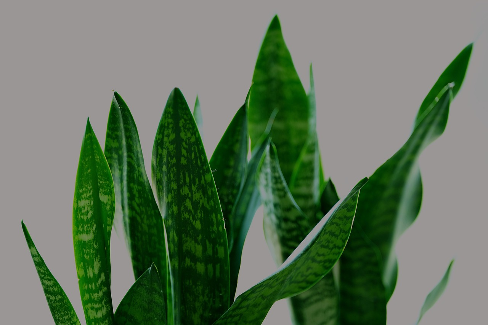
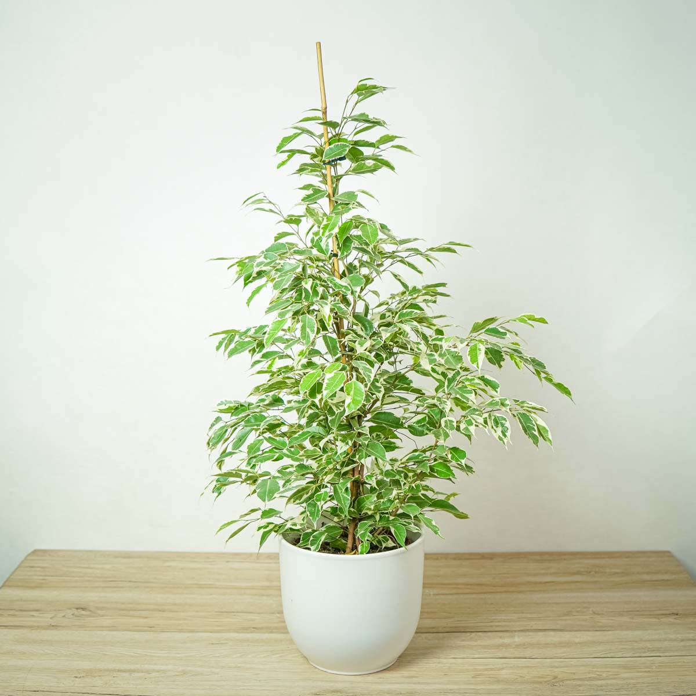

# 🌼 Przykłady roślin doniczkowych

Poniżej przedstawiamy kilka popularnych roślin doniczkowych wraz z opisem ich wymagań. Do każdego przykładu możesz dołączyć zdjęcie.

---

## 🌿 Monstera Deliciosa

- 🌞 Stanowisko: jasne, z rozproszonym światłem
- 💧 Podlewanie: gdy wierzchnia warstwa ziemi przeschnie
- 🌱 Nawożenie: co 2 tygodnie nawozem do roślin zielonych
- 🪴 Przesadzanie: co 1–2 lata

**Cechą charakterystyczną są duże liście z naturalnymi dziurami.**

---

## 🌱 Sansewieria (wężownica)

- 🌞 Stanowisko: jasne lub półcień, bardzo wytrzymała
- 💧 Podlewanie: rzadko – nawet raz na 2–3 tygodnie
- 🌡️ Toleruje suche powietrze i brak opieki

**Idealna do biura i dla zapominalskich.**

---

## 🌴 Fikus Benjamina

- 🌞 Stanowisko: jasne, ale bez bezpośredniego słońca
- 💧 Lubi wilgotne powietrze, podlewaj regularnie
- ⚠️ Wrażliwy na przestawianie – może zrzucać liście

**Wymaga cierpliwości, ale odwdzięcza się gęstym pokrojem.**
