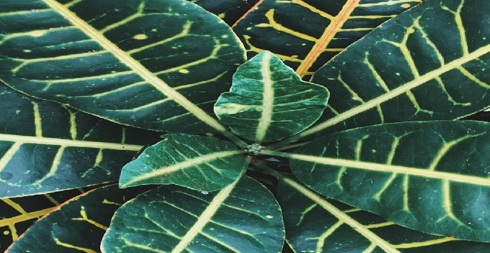

Temat projektu 🌿

Rośliny doniczkowe stały się nieodłącznym elementem naszych mieszkań, biur i przestrzeni wspólnych. Ich popularność stale rośnie, ale... czy wiemy, jak o nie naprawdę dbać? 🤔

Nasz projekt powstał z myślą o tych, którzy chcą rozpocząć zieloną przygodę lub poprawić warunki, jakie zapewniają swoim roślinom. 🌱

  

🎯 Cele projektu</h2>

Chcemy stworzyć przystępny i praktyczny przewodnik, który pomoże:

  <li>🪴 zrozumieć podstawowe potrzeby roślin doniczkowych,</li>
  <li>🔍 rozpoznawać objawy chorób i błędów w pielęgnacji,</li>
  <li>📸 poznać popularne gatunki i inspirujące aranżacje,</li>
  <li>🌿 ułatwić start osobom, które dopiero zaczynają swoją przygodę z zielenią.</li>
</ul>

💚 Nasza misja

Wierzymy, że każda roślina może pięknie rosnąć – jeśli tylko zapewnimy jej odpowiednie warunki i odrobinę troski.  
Zielony dom to szczęśliwy dom! 🏡🌿

