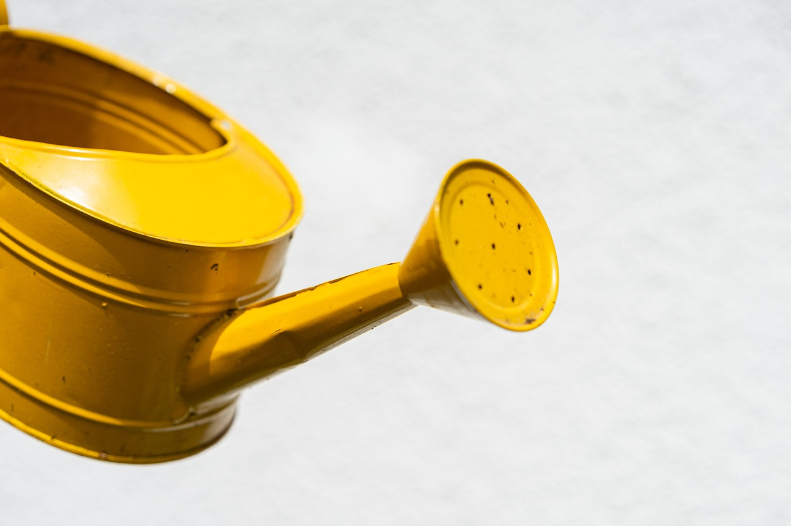
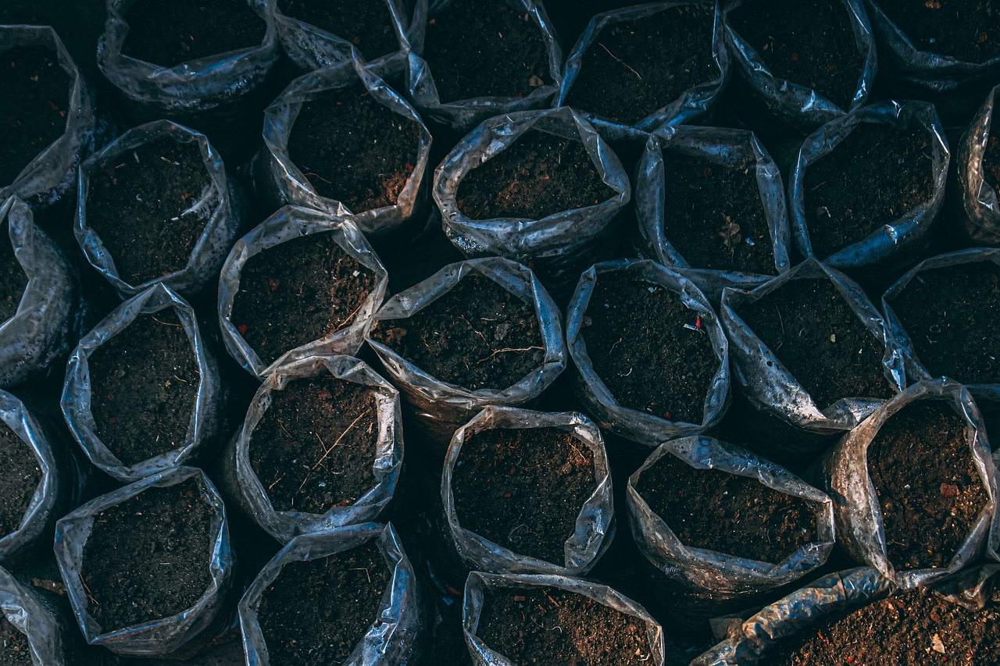
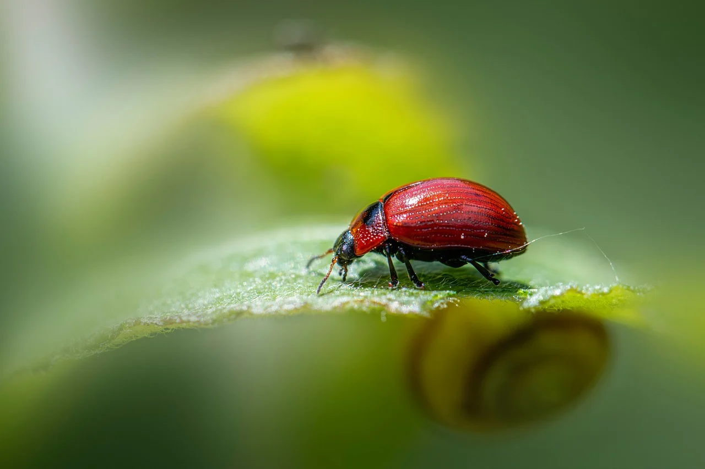

# 🌿 Teoria

## ☀️ Światło

Światło to podstawowy czynnik warunkujący życie roślin.  
Większość gatunków doniczkowych pochodzi z tropikalnych lasów, gdzie światło jest filtrowane przez korony drzew.
Dlatego wiele z nich preferuje światło rozproszone.  

🌞 Rośliny światłolubne (np. sukulenty) dobrze czują się na parapetach południowych.  
🌥️ Cieniolubne (np. paprocie) lepiej radzą sobie w głębi pokoju.

💡**Wskazówka:** Jeżeli roślina „wyciąga się” w stronę okna lub jej liście blakną — może otrzymywać za mało światła.

---

## 💧 Podlewanie

Najczęstszy błąd początkujących to zbyt częste podlewanie.  
Większość roślin nie lubi „mokrych nóg”.  
Warto sprawdzać wilgotność podłoża, np. palcem, zanim podlejemy.  

📅 **Ogólna zasada:**
- latem – podlewać częściej, co kilka dni 🌞
- zimą – rzadziej, bo rośliny odpoczywają ❄️

🕓 Podlewaj rano lub wieczorem.  
🚰 Używaj wody odstanej, w temperaturze pokojowej.

---

## 🌱 Nawożenie

Rośliny doniczkowe mają ograniczoną ilość składników odżywczych – dlatego trzeba je regularnie zasilać nawozem.

### 🧪 Rodzaje nawozów:
- 🌿 uniwersalne
- 🍀 do roślin zielonych
- 🌸 do kwitnących
- 🐛 organiczne (np. biohumus)

🗓️ Nawozimy głównie od wiosny do jesieni, zwykle co 2–3 tygodnie.

---

## 🪴 Przesadzanie

Z czasem podłoże w doniczce traci strukturę i staje się jałowe.  
Przesadzanie pozwala:

- uzupełnić świeżą ziemię,
- zwiększyć miejsce dla korzeni,
- zdiagnozować ewentualne choroby korzeni 🦠

🌼 Najlepiej przesadzać wczesną wiosną.  
Wybierz doniczkę o 1–2 cm większą niż poprzednia.

---

## 🚨 Problemy i choroby

👀 Objawy, na które warto zwrócić uwagę:

- 🍂 żółknięcie liści → nadmiar wody / brak składników
- 🔥 brunatne końcówki → suche powietrze
- 🌀 opadanie liści → stres, przeciągi, zmiana miejsca

**🧠 Zawsze reaguj na zmiany wyglądu – rośliny nie krzyczą, ale „mówią” przez liście. 🌿**